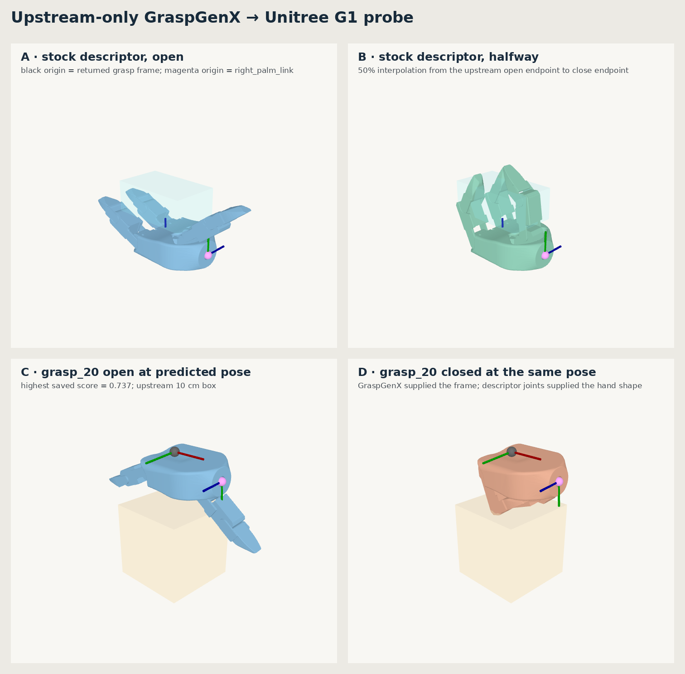
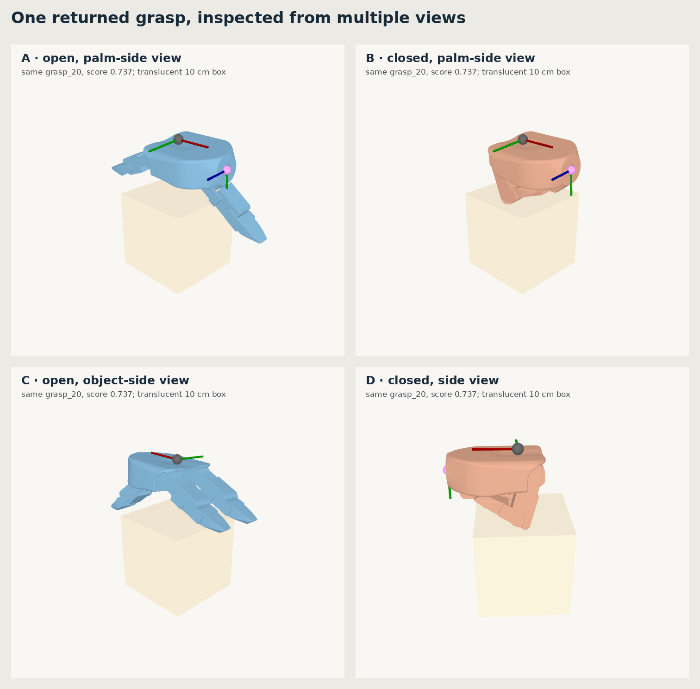

# G1 AprilCube Demo

Clean implementation of a seated Unitree G1 + Dex3 tabletop assembly demo.

The repository is intentionally at **checkpoint 0**. It contains only a pinned
upstream GraspGenX dependency, one reproducible input/output probe, and visual
evidence of the frame contract. There is no MoveIt task, no hand-authored grasp,
and no T/U/cube implementation yet.

## Fixed demo scope

- One hand picks and holds an AprilCube T by its central stem.
- The other hand attaches the U legs and cube head.
- The assembled figure is placed upright on the table.
- Grasp candidates come from GraspGenX; OMPL is the motion-planning backend.

## Current visual checkpoint





Read [the verified GraspGenX contract](docs/graspgenx_contract.md) before adding
any robot or MoveIt code.

## Pinned upstream dependency

```text
GraspGenX b9429097728cb1c430dd78b92edf17ba318aad03
```

Clone with submodules:

```bash
git clone --recurse-submodules <this-repository>
```

The GraspGenX checkout downloads model checkpoints and gripper descriptions on
first import. Its Unitree hand meshes are stored with Git LFS; verify that the
actual meshes, rather than 130-byte pointer files, are materialized before
trusting a render.

## Reproduce checkpoint 0

Create the GraspGenX environment from its pinned `pyproject.toml`, then set both
asset variables **before importing GraspGenX**:

```bash
export GRASPGENX_CHECKPOINT_DIR=/absolute/path/to/graspgenx_checkpoints
export GRASPGENX_GRIPPER_CFG_DIR=/absolute/path/to/gripper_descriptions
```

Generate a fresh raw candidate set with the upstream script:

```bash
python third_party/GraspGenX/scripts/demo_object_mesh.py \
  --mesh_file third_party/GraspGenX/assets/sample_data/object_mesh/box.obj \
  --checkpoints "$GRASPGENX_CHECKPOINT_DIR/release" \
  --gripper_name unitree_g1 \
  --grasp_threshold -1.0 --return_topk --topk_num_grasps 20 \
  --num_grasps 80 --num_sample_points 3500 --no-visualization \
  --output_file artifacts/upstream_probe/unitree_box_grasps.yml
```

The model is stochastic, so a fresh YAML need not match the committed snapshot.
Render the generated set:

```bash
PYOPENGL_PLATFORM=egl python tools/render_upstream_unitree_probe.py
```

The renderer refuses to run when the palm mesh still looks like a Git LFS
pointer. [Probe provenance](artifacts/upstream_probe/provenance.yaml) records the
exact revisions and input hash used for the committed images.

## Phase gate

The next phase starts only after the two images above and the frame equation in
the contract are accepted. The next code will import the real AprilCube T, U,
and cube meshes and generate raw candidates—still without MoveIt.
