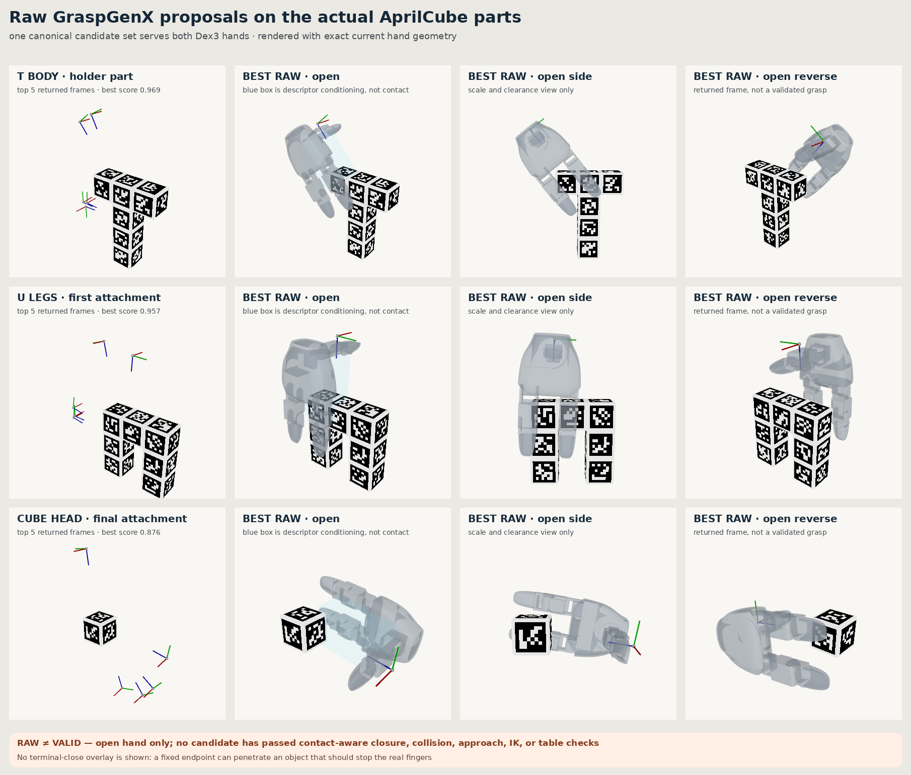
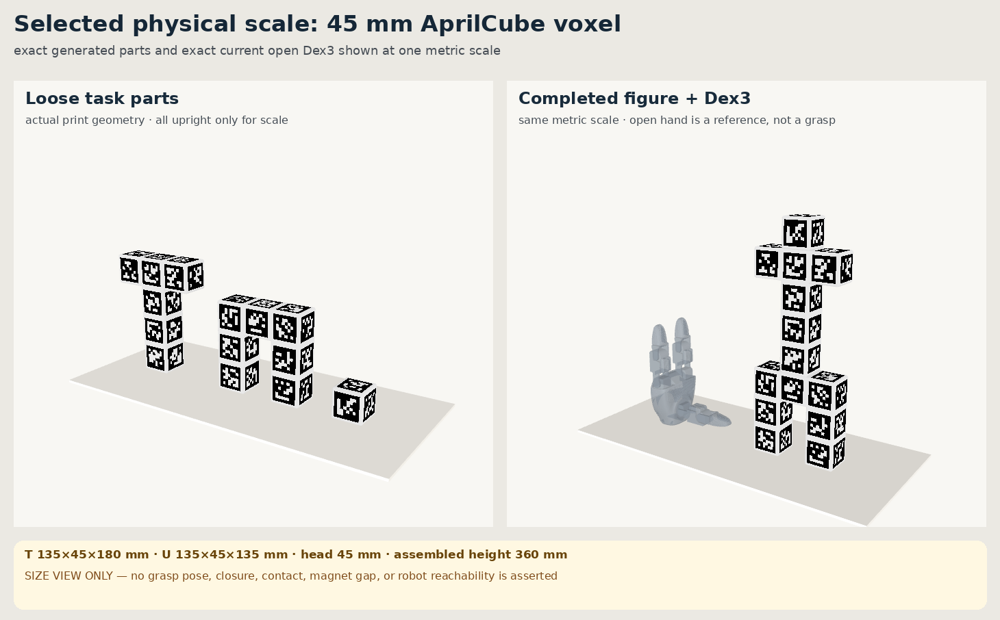

# AprilCube raw-grasp visual checkpoint (historical)

> This page records the raw-candidate stage before physics. It is not the
> current project gate. The first current-Dex3 descriptor used for these images
> was later shown to be incorrectly conditioned. See
> `docs/dex3_rev1_descriptor.md` and the canonical 118/120 rerun before using
> any candidate or confidence number here.

This checkpoint used the actual generated task geometry and the then-current
Dex3 GraspGenX descriptor. It deliberately stopped before candidate
qualification.



## Physical parts fixed for this checkpoint

All three parts come from the pinned `sri299792458/aprilcube` generator at
commit `fc18d50c8bbaadc9646dfd0aa5fcd2404a9868c5`.

| Part | Occupied voxels | Printed envelope | AprilTag IDs |
|---|---:|---:|---:|
| T body | 6 | 135 × 45 × 180 mm | 0–25 |
| U legs | 7 | 135 × 45 × 135 mm | 64–93 |
| cube head | 1 | 45 × 45 × 45 mm | 128–133 |

Every voxel is 45 mm. Every marker is a 36 mm AprilTag 36h11 marker, and the
complete solid has 3 mm tangent edge fillets. The completed U + T + cube figure
is 360 mm tall before any future connector gap is introduced.

The first generated revision used 30 mm voxels because that scale satisfied the
marker cell grid. Its open-hand render made the real problem obvious: the parts
were undersized relative to Dex3. That revision was rejected. The selected
45 mm scale uses the normal 36 mm AprilTag 36h11 marker: its 8 × 8 logical
grid has 4.5 mm cells and the one-cell border produces an exact 45 mm face.
Print-grid compatibility is now a consequence of the physical scale decision,
not the reason for choosing the scale.

The selection is also physically coherent with the current hand model. The
open Dex3 is approximately 175 mm long and 88 mm wide; each distal finger link
is approximately 59 mm long with an 18 × 26 mm cross-section. A 45 mm face is
therefore large enough to present useful multi-pad area without making each
loose part larger than the hand. This is a scale argument only—the contact-aware
qualifier must still prove that particular candidates close and retain.



Magnet pockets are not present yet. These meshes fix the exterior shape used
for grasp planning; connector geometry remains a later, separately reviewed
revision.

## Why there are two meshes for each part

The AprilCube textured OBJ partitions its visible surface into many marker
patches. That is correct for rendering and pose-estimation assets but is a poor
source for geometric point sampling because generic mesh tools see many
coplanar components.

The build therefore retains:

- `mujoco/cube.obj`: exact textured AprilCube visualization/perception asset;
- `cube.3mf`: printable dual-color asset;
- `grasp_mesh.obj`: clean watertight outer surface for GraspGenX and collision
  calculations.

The grasp mesh is produced from the same occupied voxels and the same 3 mm
morphological fillet operation, without the color/material partition. All
three meshes are watertight, consistently wound positive-volume solids.

## Why inference runs once rather than once per arm

The current left and right Dex3 descriptors have identical canonical geometry
and identical GraspGenX conditioning fields:

```text
sweep_volume + fingertip + standoff + gripper type + symmetry
```

Their physical palm transforms differ, but that fixed conversion happens after
GraspGenX returns `object_T_G`. Consequently one canonical candidate set is
valid input to either arm's later IK/reachability test. Running the neural model
twice would create two stochastic samples without representing a meaningful
left/right distinction.

## Observed raw output

The released checkpoint generated 240 proposals per object; the top 20 by
network confidence were retained.

| Part | Top-20 confidence range | What the current visual establishes |
|---|---:|---|
| T body | 0.955–0.991 | returned frame and open-hand placement only |
| U legs | 0.936–0.978 | returned frame and open-hand placement only |
| cube head | 0.787–0.879 | returned frame and open-hand placement only |

These images make no grasp-validity claim. An earlier version rendered the
fixed terminal close vector at the returned frame and called the U proposal
invalid because the hand did not enclose the object. That conclusion was not
supported: the rendered fingers passed through geometry even though physical
fingers should stop at first contact. The panel and conclusion were removed.

Network confidence still is not a grasp-success certificate, but it takes a
contact-aware qualifier—not a penetrative terminal-pose render—to determine
which proposals work with the exact current Dex3.

## Reproduce

Generate the print and visualization assets in the AprilCube environment:

```bash
python tools/build_aprilcube_parts.py
```

Generate watertight physical meshes in the GraspGenX environment:

```bash
python tools/build_aprilcube_grasp_meshes.py
```

Run the pinned released checkpoint:

```bash
python tools/run_aprilcube_raw_grasps.py \
  --checkpoints /path/to/graspgenx_checkpoints/release
```

Render this checkpoint:

```bash
PYOPENGL_PLATFORM=egl python tools/render_aprilcube_raw_grasps.py
```

## What happened next

The hand-written geometric qualifier proposed here was not adopted. Every raw
candidate now goes unchanged into the released GraspDataGen Isaac/PhysX
close-and-five-tug validator. After the descriptor root-cause fix, the normal
named current-right-Dex3 pipeline retained 118/120 cube candidates. Left-hand
and T/U qualification are next; approach corridors, table collision, and arm
IK remain later scene-planning filters.
