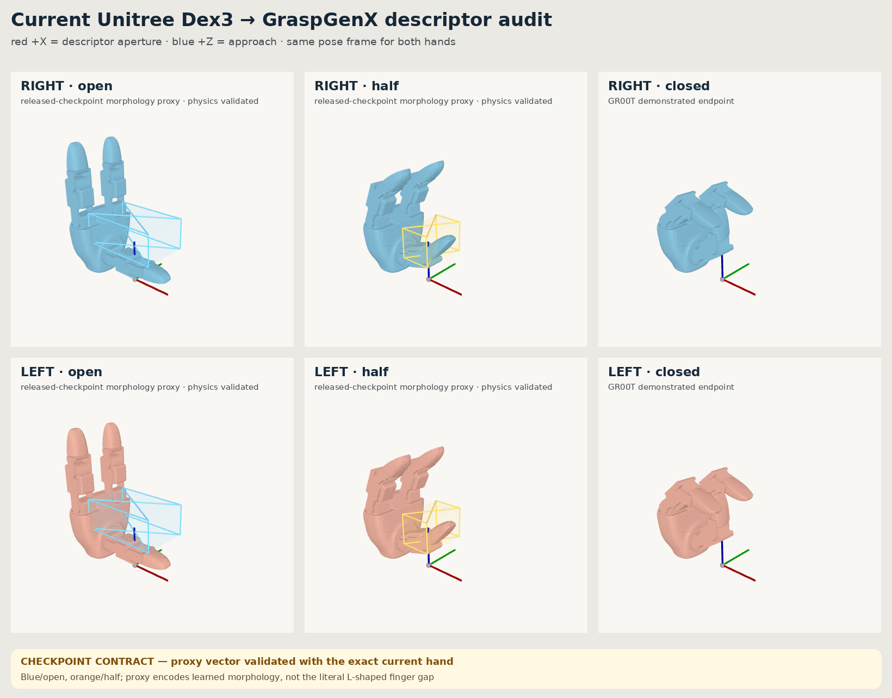

# Current Dex3 GraspGenX descriptor

This document records the descriptor contract we actually tested. The current
Dex3 hand model is exact; its 12-number GraspGenX conditioning vector is a
physics-qualified compatibility proxy for the released checkpoint. Those are
two separate facts.



## What inference can and cannot see

The pinned generator and discriminator both use GraspGenX's
`sweep_volume_v2` gripper encoder. They receive exactly:

```text
open box:     extent xyz + center xyz
half-open box: extent xyz + center xyz
                                      = 12 numbers
```

They do **not** receive the Dex3 URDF, meshes, seven joint values, closing
trajectory, collision geometry, or left/right identity. Those assets enter
only after inference, when a returned `object_T_G` pose is rendered, simulated,
or executed. Consequently, replacing the physical hand while supplying a bad
12-vector can produce bad proposals even when the URDF and physics are correct.

## Exact current-hand assets

Both descriptors are built from Unitree `xr_teleoperate` commit
`7dc9aa1a6edbf4a9f4f887d8ab6fc449ea5135f6`:

- current palm and finger meshes;
- the current seven-joint kinematic trees, limits, names, and signs;
- separate mirrored left and right URDFs; and
- the official collision geometry.

Teleoperation-only virtual links are stripped. Each descriptor contains only:

```text
GraspGenX root G
    └── fixed G_T_palm
        └── official palm and seven finger joints
```

The fixed right and left transforms place both physical hands in the same
GraspGenX pose convention. The resulting open-hand bounding boxes agree to
less than a nanometre.

Open and close endpoints come from the G1 Dex3 profiles in
GR00T-VisualSim2Real commit
`92bf086357156f04273cc5a3e9559e6b1415c8c7`. They are current simulated and
hardware-demonstrated starting values, but GraspGenX inference does not read
them. Isaac/PhysX does.

## The defect in the first descriptor

The first current-hand descriptor used:

```text
open: extent [0.05, 0.06, 0.10], center [-0.02858, 0, 0.074]
half: extent [0.04, 0.06, 0.06], center [-0.00458, 0, 0.091]
```

That fit was visually plausible around the current zero-joint hand, whose open
posture is L-shaped. It was nevertheless a bad conditioning vector for the
released checkpoint. In GraspGenX's convention, X carries the gripper aperture
and Z carries approach/depth. The fit put only 50 mm in open X and 100 mm in Z.
The upstream code itself treats `extents_open[0]` as gripper width and the
open box's Z location as fingertip depth. The model was therefore told about a
deep, narrow morphology that did not describe the useful current-Dex3 pinch.

The upstream wizard was not at fault. Its terminal-geometry estimate correctly
noticed that the largest instantaneous gap in this L-shaped pose lies along
the existing frame's Z axis. Our error was claiming that this literal box also
preserved the checkpoint's learned X-aperture/Z-depth semantics.

## How the cause was isolated

All counts below use the same 45 mm AprilCube, 120 candidates, 0.12 kg object,
exact current close trajectory, self-collision disabled to match upstream, and
the released GraspDataGen Isaac/PhysX close-and-five-tug validator.

### 1. Cross the proposal set and physical hand

| Candidate source | Released hand | Current hand |
|---|---:|---:|
| Released descriptor | 110/120 | 118/120 |
| First current descriptor | 5/120 | 16/120 |

The current hand retains released-descriptor poses extremely well, while both
physical hands reject the first current-descriptor poses. That localizes the
large regression to proposal conditioning, not current-hand contact mechanics.

### 2. Replace descriptor fields factorially

The four field groups were independently selected from the first current
vector or released Unitree vector. Important outcomes were:

| Descriptor change | Retained |
|---|---:|
| none; first current vector | 16/120 |
| half-open center only | 64/120 |
| open extents only | 111/120 |
| all released fields | 118/120 |

Replacing only the open extents removes almost the entire regression. The
complete 16-cell result is preserved under `artifacts/dex3_sweep_ablation/`.

### 3. Test—not assume—a new frame

The open terminal geometry gives a 53.1326-degree X/Z realignment that places
the thumb-to-opponents separation on X. We ran inference in that aligned frame,
converted every result back into the unchanged execution frame, and sent it to
the same physics validator. Simple rotation and rotation-plus-XY-centering
both retained 0/120; adding a 70 mm Z center retained 31/120. This rejects that
specific straightforward realignment as the fix. It does not prove that no
possible learned-frame/descriptor redesign could work.

### 4. Separate current aperture measurements from released offsets

A semantic vector using the measured current open and half-open gaps in the X
aperture slots, with released transverse/depth dimensions and offsets, retained
467/480 across seeds 19, 29, 39, and 49. The unchanged released Unitree vector
retained 472/480 on the exact current hand over the same four seeds. The 5-grasp
difference is small and sampling-dependent; both results support the same
diagnosis.

## Current checkpoint contract

The selected conditioning vector is the released Unitree vector unchanged:

```text
open: extent [0.10, 0.06, 0.04], center [0.000, 0.000, 0.070]
half: extent [0.04, 0.06, 0.04], center [0.007, 0.000, 0.060]
```

This is a **checkpoint-compatible morphology proxy**, not a claim that these
boxes are the exact axis-aligned swept volume of the current L-shaped hand.
The exact current URDF, `G_T_palm`, open/close joint values, collision meshes,
and controller remain authoritative for physical qualification and execution.

The normal named pipeline—not an ablation helper—was rerun after installing
this contract. It produced 120 candidates and Isaac/PhysX retained 118. The two
non-retained candidates were `grasp_72` and `grasp_97`; the validator stores
successful entries only by default, which is why its console reports
“118 successes and 0 fails.” This result establishes 118/120, not 120/120.

The identical 120 canonical `object_T_G` proposals were then replayed with the
exact mirrored current left hand, its signed close trajectory, and its fixed
`G_T_left_palm`. It retained 116/120; failures were `grasp_37`, `grasp_96`,
`grasp_97`, and `grasp_98`. The high mirrored retention rules out a gross
left-frame conversion error. The small right/left pass-set difference is not
assigned a cause here; those candidates lie at the contact-test boundary and
would need a controlled tolerance/contact study if exact mirror symmetry
became important.

Evidence is in:

- `artifacts/dex3_descriptor_canonical_validation/`;
- `artifacts/dex3_frame_ablation/`;
- `artifacts/dex3_descriptor_fresh_seeds/`; and
- `artifacts/dex3_sweep_ablation/`.

## Rebuild and check

```bash
PYOPENGL_PLATFORM=egl uv run python tools/build_dex3_rev1_descriptors.py \
  --source-root .cache/unitree_xr_teleoperate

uv run python tools/test_graspgenx_frame_contract.py
```

Runtime descriptors are generated directly where GraspGenX resolves them:

```text
third_party/GraspGenX/assets/x_grippers/dex3_rev1_right/
third_party/GraspGenX/assets/x_grippers/dex3_rev1_left/
```

The test checks two narrow contracts: translating the object point cloud
translates returned poses, and the generated config contains the manifest's
exact 12-number vector. Isaac/PhysX—not that file test—establishes retention.

## Remaining claim boundary

This checkpoint validates intrinsic simulated cube retention for both current
hands. It does not yet establish table clearance, G1 arm reachability,
left-hand T/U retention, real hardware force, or magnetic assembly. A later
right-hand screen found intrinsic T and U candidates, but not their scene or
connector clearance. This document also does not
prove that the released proxy is the optimal descriptor; it proves that it is
a high-performing, reproducible contract for the released checkpoint and exact
current hands.
