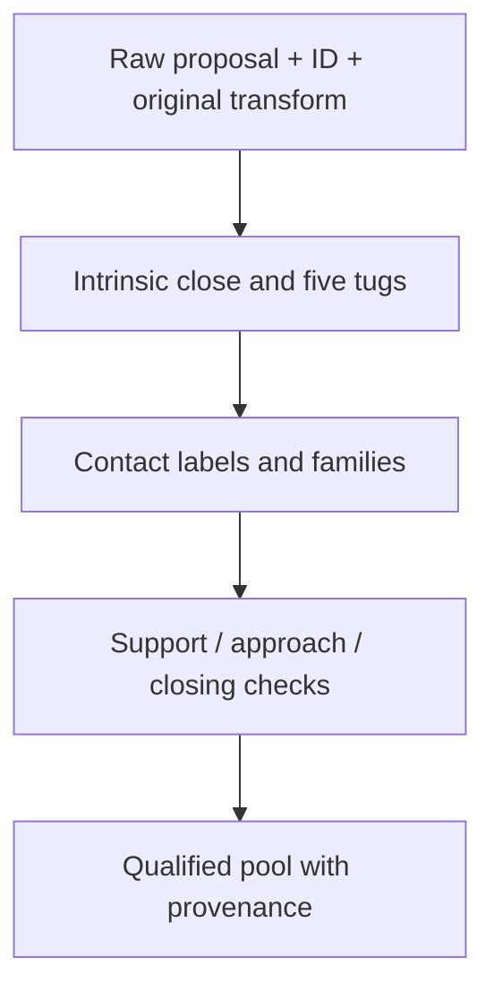

# Grasp generation and qualification

The pipeline keeps neural proposal identity separate from the tests that decide
whether a candidate is usable. GraspGenX returns `object_T_G` and confidence.
The fixed descriptor transform gives `object_T_palm = object_T_G @ G_T_palm`.
It does not return arm trajectories or candidate-specific finger commands.

| Stage | Implementation |
| --- | --- |
| Current hand descriptor and canonical frame | [`build_dex3_rev1_descriptors.py`](../tools/build_dex3_rev1_descriptors.py) |
| Seeded neural sampling and raw candidate identity | [`run_aprilcube_raw_grasps.py`](../tools/run_aprilcube_raw_grasps.py) |
| Isaac input and intrinsic qualification | [`build_dex3_isaac_grasp_input.py`](../tools/build_dex3_isaac_grasp_input.py), [`run_isaac_atlas_qualification.py`](../tools/run_isaac_atlas_qualification.py) |
| Contact labeling and families | [`build_grasp_atlas.py`](../tools/build_grasp_atlas.py) |
| Supported approach geometry | [`support_atlas.py`](../g1_aprilcube_demo/grasping/support_atlas.py) |
| Supported pickup trial runner | [`run_isaac_supported_pickup.py`](../tools/run_isaac_supported_pickup.py) |
| Shortlist with closure evidence | [`executable_shortlist.py`](../g1_aprilcube_demo/grasping/executable_shortlist.py) |
| Preserve original poses in supported pools | [`build_supported_arm_grasp_pool.py`](../tools/build_supported_arm_grasp_pool.py) |

## Contracts that matter when extending it

The descriptor's 12 values are a learned conditioning proxy. The exact current
URDF and collision geometry govern downstream checks. Read the
[descriptor investigation](dex3_rev1_descriptor.md) before changing the boxes:
a visually plausible literal enclosure performed much worse than the released
conditioning vector.

Preserve the original proposal transform and ID through filtering. A simulated
object can move during closure, so the final hand/object relationship is not
the original planning goal. Contact aggregation uses a body-pair magnitude;
summing opposing vectors can erase real contact in the reported quantity.

Intrinsic qualification answers whether the hand can retain the object in the
declared simulation. Supported pickup adds approach, tabletop contact, lift and
final-hold requirements. Neither establishes collision-free whole-arm execution
or real robot grasp success. Generated reports retain each gate independently.

The VIRAL-profile results use a particular simulated controller, timestep,
contact configuration and object mass. The 45 mm cube/T/U counts are 2,437,
1,240 and 675 retained proposals out of 4,096 each. These counts belong to that
profile and geometry. The separate 40 mm cube pool contains 3,178 candidates;
scaling a 45 mm atlas would not reproduce its contact geometry.

The checked-in 40 mm pool and tripod shortlists preserve `isaac_closed_q` as
simulation evidence. The later hardware pipeline uses a separately qualified
closing contract. See the
[physical close correction](https://sri299792458.github.io/g1-research-docs/manipulation/grasp-atlas.html#why-simulated-closed-joints-were-the-wrong-hardware-command).

## Available evidence and outputs

The public source includes the 40 mm arm pool, one executable shortlist, three
tripod shortlists and the original upstream probe/provenance. Full trial traces,
all generated atlases and model checkpoints are separate outputs. Paths to
those outputs in historical reports do not mean they are included in a clone.
Simulation and inference commands may generate large outputs or download
upstream assets; importing GraspGenX can also resolve external assets.

The checked-in U-support reports preserve both failed broad-face trials and
successful upright trials. Start with
[broad-face results](u_legs_broad_face_supported_pickup.md),
[upright discovery](u_legs_upright_supported_pickup.md) and
[upright replay](u_legs_upright_supported_pickup_replay1.md).
These are recorded simulation results, not a request to rerun the experiments.
