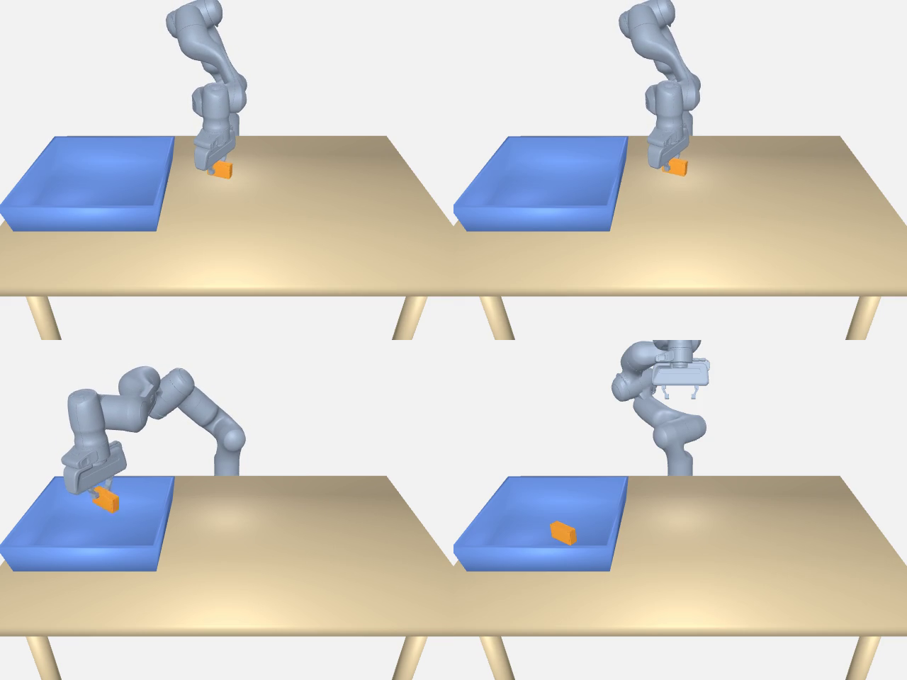

# GraspGenX end-to-end Newton baseline

## Verdict

**PASS.** The pinned, unmodified GraspGenX Franka example generated grasps,
filtered them against the scene, selected one through cuRobo, and physically
picked and dropped the object in Newton/MuJoCo-Warp.

[Watch the 25.5 second result](assets/graspgenx_franka_newton_baseline.mp4).



The four frames show physical closure, transport above the bin, release, and
the final object at rest. This is not the old penetrative hand render.

## What this proves

This establishes a working reference implementation for the complete contract:

```text
object mesh point cloud
  -> GraspGenX candidates and confidence
  -> exact gripper-mesh/scene collision filter
  -> grasp-frame-to-robot-tool conversion
  -> cuRobo approach, grasp, lift, transport, and drop trajectories
  -> Newton playback under gravity, contacts, and joint drives
  -> outcome test from the simulated object trajectory
```

It does **not** prove that the current Dex3 descriptor, its open/close profile,
its controller gains, or any AprilCube candidate works. GraspGenX does not ship
a G1/Dex3 end-to-end robot profile. Its `unitree_g1` asset is the older
inference descriptor only.

## Exact provenance

- GraspGenX: `b9429097728cb1c430dd78b92edf17ba318aad03`
- gripper descriptions: `19a03c00d19aeaf052d0f6801f0041982d676e8a`
- cuRobo: `057a96ffb1088531535f9915154f9d0dabd62428`
- PyTorch: `2.6.0+cu124`
- Newton: `1.0.0`
- Warp: `1.15.0`
- MuJoCo / MuJoCo-Warp: `3.5.0` / `3.5.0.2`
- `cuda-core`: `0.7.0`, satisfying GraspGenX's declared
  `cuda-core[cu12]<1.0` constraint
- NumPy: `1.26.4`

The final environment passed `uv pip check` across all 165 installed packages.

## Exact command

Run from `third_party/GraspGenX` with the project environment:

```bash
PYOPENGL_PLATFORM=egl PYGLET_HEADLESS=true \
  ../../.venv/bin/python -u end2end/e2e_grasp_demo.py \
  --robot_config end2end/robots/franka_panda.yaml \
  --env_config end2end/envs/single_bin_demo.yaml \
  --task clutter_pick_and_drop --playback_mode dynamic --no-viser \
  --num_grasps 200 --topk 80 --grasp_threshold 0.7 \
  --planner graspmoe --seed 0 \
  --export-trajectory end2end/runs/franka_single/trajectory.json
```

Before a fresh run, materialize the external LFS/runtime assets once:

```bash
.venv/bin/python tools/setup_graspgenx_end2end.py
```

## Observed result

- 200 neural proposals were sampled; 79 cleared confidence 0.7.
- The combined diffusion/OBB pool supplied 80 ranked grasps.
- 36 candidates passed the exact Franka gripper-mesh/scene filter and reached
  cuRobo.
- cuRobo selected goal-set entry 20: original GraspGenX proposal 7, confidence
  `0.783`.
- Newton lifted the object by `0.196 m` at the lift checkpoint. Across the
  whole trajectory its peak rise was `0.240 m`.
- The final object position was `0.053 m` in X and `0.039 m` in Y from the bin
  center, inside the test's `0.220 m` half-width bound.
- Outcome: `1/1 objects dropped in bin`, zero retries, process exit code 0.
- Export: 1,532 physics/result frames.

## Upstream simulation/control settings actually used

- Gravity: `-9.81 m/s^2`; table and hollow five-primitive bin included.
- Requested physics step: `0.001 s`.
- Rendering/task rate: `60 Hz`, producing 17 physics substeps per frame and an
  effective step of about `0.0009804 s`.
- Collision refresh: every 4 physics substeps.
- Object: `0.2 kg`, friction `10.0`.
- Finger shapes: friction `3.0`.
- Contact stiffness/damping/adhesion: `50000 / 500 / 1000`.
- MuJoCo-Warp solver iterations/line-search iterations: `100 / 50`;
  impedance ratio `1000`.
- Franka profile, overriding generic defaults: arm `kp=2000`, `kd=100`;
  fingers `kp=4000`, `kd=400`; gripper armature `0.5`; finger effort limit
  `1000`.

The Franka finger values are part of the Franka reference result. They are not
Dex3 values.

## Setup faults found before the valid run

Two earlier invocations stopped before planning and were not counted as
algorithm failures:

1. `franka_panda/vis_mesh.obj` was a 132-byte Git-LFS pointer. FCL received an
   empty mesh and aborted. `git lfs pull` materialized the 1.72 MB mesh with
   4,295 vertices.
2. cuRobo had been installed editable with `--no-deps`, so `cuda.core` was
   absent. Installing GraspGenX's declared end-to-end dependency range fixed
   the planner backend. The final run used `cuda-core 0.7.0`, not the broader
   `1.1.0` initially allowed by cuRobo alone.

## How VIRAL enters, and where it does not

The current hardware-demonstrated GR00T-VisualSim2Real/VIRAL G1 profile uses:

```text
thumb_0:                 kp 2.0, kd 0.1
other six finger joints: kp 0.5, kd 0.1
```

Those are useful Dex3 starting values, but they belong to a different robot,
joint inertia/armature setup, controller update path, and simulator. They must
not overwrite the GraspGenX Franka baseline or masquerade as upstream
GraspGenX defaults.

The next implementation therefore needs two explicitly named current-Dex3
profiles:

1. `graspgenx_default`: the generic upstream Newton starting values, used only
   as a controlled comparison.
2. `viral_visualsim2real`: per-joint `2.0/0.1` for `thumb_0` and `0.5/0.1` for
   the other six, with its armature and effort-limit provenance recorded.

The current upstream dynamic interface accepts only one scalar finger `kp` and
`kd`. Our Dex3 adapter must support per-joint maps before the VIRAL profile can
be represented faithfully. Both profiles must then run the same current-Dex3
closure/lift scene, with the same candidate, object, gravity, contact material,
step size, and pass criteria. Only the controller profile may differ.

Both untested profiles are encoded in
`config/dex3_newton_control_profiles.yaml`. The VIRAL values were checked
programmatically against the pinned source: all gains and raw effort limits
match, and the recorded armatures match the source values after its Isaac Sim
adapter's explicit `x3` multiplication. Run
`tools/check_dex3_control_profiles.py` to verify full seven-joint coverage
against both generated current-Dex3 URDFs. That check is structural; it does
not claim physics success.

The earlier custom zero-gravity/free-object qualification runs are diagnostic
history, not baseline results, and should not be used to choose a grasp.
