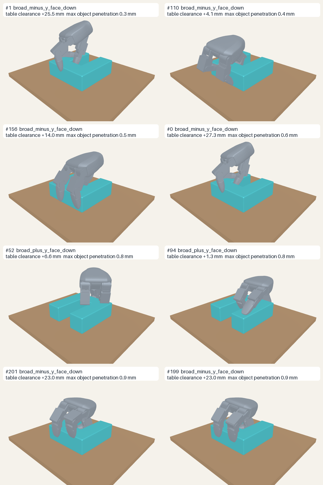

# Lightning-Grasp assessment for the broad-face AprilCube U

## Verdict

Lightning-Grasp is useful to this project as a second offline source of
articulated Dex3 grasp candidates, but the released system does **not** solve
the broad-face U tabletop pickup by itself.

The important positive result is real: after adapting the exact current right
Dex3 hand, Lightning-Grasp produced 14 final grasp configurations that:

- place the U on either of its two broad faces;
- keep the exact Dex3 collision geometry above the table; and
- remain within the paper's practical 2 mm hand/object penetration margin.

This is much better final-pose diversity than the corresponding unconditioned
GraspGenX result. However, none of those 14 configurations retained the U in
the project's Isaac/PhysX open-hand, close, 20 cm lift, and hold experiment.
A controlled overclosure sweep on the four candidates whose entire closing
motion avoided the table also produced zero successful pickups.

Therefore:

- keep Lightning-Grasp available for offline candidate generation;
- do not hand its outputs directly to cuRobo as executable grasps;
- require a support-aware pre-shape/closing path and the same Isaac physical
  qualification used for every other candidate source; and
- retain the upright U and its already qualified grasps as the current
  implementation route.

## What the released system actually provides

According to the [paper](https://arxiv.org/abs/2511.07418) and
[official repository](https://github.com/zhaohengyin/lightning-grasp),
Lightning-Grasp is a procedural contact-field grasp synthesizer. Its relevant
contract is:

```text
input
  articulated hand URDF and collision meshes
  hand-specific contact-field configuration
  object mesh

output, once per solution
  G_T_object   object pose in the hand's base frame G
  q            articulated hand joint configuration
```

Unlike our GraspGenX pipeline, `q` is optimized for each individual result.
That is the reason this work was worth testing: it can propose different
Dex3 finger shapes for the U rather than pairing every hand pose with one
generic closing profile.

The released pipeline optimizes object placement, contact fields, contact
stability, hand inverse kinematics, and collision filters. It does not include:

- a tabletop or other scene obstacles;
- an open-hand pregrasp;
- a collision-free approach;
- a physically simulated closing trajectory;
- a lift or disturbance test;
- robot-arm reachability or motion planning; or
- a real-hand controller.

The paper's stability objective and collision filtering qualify a final
hand/object configuration. They do not establish that the real hand can enter
that configuration from an open pose while the object rests on a table.

The current release also uses precompiled CUDA extensions and has not yet
published their CUDA source. It is licensed CC BY-NC 4.0 for academic and
research use, not commercial use. The exact code tested here is official
commit `af43818e864b0389c97b73429e5e60de2a2de593`.

## Exact adaptation

The upstream repository is retained at:

```text
third_party/lightning-grasp
```

Its persistent Python 3.9 environment is:

```text
third_party/lightning-grasp/.venv
```

The upstream release bundles Allegro, Shadow, LEAP, and DClaw adapters, but no
Dex3 adapter. The narrow local adaptation adds:

1. `lygra/robot/dex3.py`, which identifies the seven current right-Dex3 joints,
   the palm, and the three terminal digit links.
2. A `dex3_rev1_right` factory entry.
3. `--robot_urdf_path`, so synthesis uses the project's exact versioned URDF.
4. A deterministic seed and NPZ output containing `G_T_object`, `q`, joint
   order, input paths, and provenance.

The hand model is not recreated inside Lightning-Grasp. It is the exact
current-Dex3 descriptor already established in:

```text
third_party/GraspGenX/assets/x_grippers/dex3_rev1_right/gripper.urdf
```

The synthetic `world`/G base and its fixed transform to the physical palm are
therefore reused rather than guessed again. The exact object input is:

```text
generated/aprilcube_parts/u_legs/grasp_mesh.obj
```

## Generation and geometric audit

The largest successful run on the local RTX A5500 used 1,024 outer samples,
128 inner samples, three requested contacts, and 4,096 object surface points:

```bash
cd third_party/lightning-grasp
env \
  LD_LIBRARY_PATH="$(pwd)/.venv/lib/python3.9/site-packages/torch/lib:${LD_LIBRARY_PATH:-}" \
  CUDA_VISIBLE_DEVICES=0 \
  .venv/bin/python demo.py \
    --robot dex3_rev1_right \
    --robot_urdf_path ../GraspGenX/assets/x_grippers/dex3_rev1_right/gripper.urdf \
    --object_mesh_path ../../generated/aprilcube_parts/u_legs/grasp_mesh.obj \
    --object_pose_sampling_strategy exhaustive \
    --batch_size_outer 1024 \
    --batch_size_inner 128 \
    --n_contact 3 \
    --n_sample_point 4096 \
    --ik_finetune_iter 5 \
    --seed 20260729 \
    --output_npz ../../artifacts/lightning_grasp/u_legs_dex3_right_exhaustive_seed20260729_large.npz
```

It returned 287 solutions. A larger 2,048 × 256 attempt exceeded local GPU
memory during kinematic fine-tuning; no partial output from that attempt was
used.

The project-side audit applies each returned final grasp to both exact
broad-face support transforms:

```text
support_T_G = support_T_object @ inverse(G_T_object)
```

It then forward-kinematically places every exact Dex3 collision mesh, measures
minimum table-plane clearance, and uses FCL to measure hand/U intersection.
It does not invent a pregrasp, approach, or closing motion.

| Audit stage | Count |
|---|---:|
| Lightning-Grasp outputs | 287 |
| Candidate/support pairs | 574 |
| Final poses clear of the table | 18 |
| Table-clear and at most 2 mm hand/U penetration | 14 |
| Unique eligible Lightning candidates | 14 |
| Best final table clearance | 27.29 mm |



The machine-readable audit is
`artifacts/lightning_grasp/u_legs_broad_face_audit_large.json`.

## Isaac/PhysX qualification

### Exact returned configurations

All 14 eligible final configurations entered the existing VIRAL-faithful
right-Dex3 Isaac/PhysX profile. No made-up approach offset was introduced:

1. the hand base was held at Lightning-Grasp's returned final base pose;
2. the fingers started at the project's standard open configuration;
3. the seven joints closed to Lightning-Grasp's returned `q`;
4. the hand lifted 20 cm over four seconds; and
5. the scene held for one second under gravity.

| Outcome | Count |
|---|---:|
| Trials | 14 |
| Full pickup PASS | 0 |
| Final contact on at least two digit groups | 0 |
| Any hand/table contact | 10 |
| U still contacting table at final hold | 14 |

The complete result is in
[`lightning_grasp_u_isaac_close_lift.md`](lightning_grasp_u_isaac_close_lift.md).
The sequential review video is
[`lightning_grasp_dex3_u_close_lift_isaac14.mp4`](assets/lightning_grasp_dex3_u_close_lift_isaac14.mp4).

### Controlled overclosure diagnostic

A position-controlled hand commanded exactly to a contact configuration may
have no residual squeeze. To test whether this alone explained the failures,
the four candidates with no table contact anywhere in the baseline closing
motion were rerun at 5%, 10%, 20%, 35%, and 50% continuation beyond their own
open-to-contact joint displacement, clipped to the exact joint limits.

| Outcome | Count |
|---|---:|
| Trials | 20 |
| Full pickup PASS | 0 |
| Final contact on at least two digit groups | 0 |
| Any hand/table contact | 0 |
| U still contacting table at final hold | 20 |

This eliminated the table collision as a confounder. Instead, the closing
fingers displaced the U laterally and lost contact. The complete result is in
[`lightning_grasp_u_isaac_overclosure.md`](lightning_grasp_u_isaac_overclosure.md),
with all trials in
[`lightning_grasp_dex3_u_overclosure_isaac20.mp4`](assets/lightning_grasp_dex3_u_overclosure_isaac20.mp4).

## Why the analytic result and pickup result differ

Lightning-Grasp answers:

> Is there an articulated final hand/object configuration with promising
> contacts and analytic stability?

Our tabletop task additionally asks:

> Can an open current Dex3 reach that configuration, close without striking
> the table or pushing the free U away, establish sustained contacts, and lift
> it under gravity?

Those are different contracts. The first is a useful proposal generator for
the second, but it cannot replace the second. The flat U is especially
difficult because the table blocks the lower half of its potential grasp
space, while contact made from above can push the unconstrained object across
the table before force closure develops.

The zero-pass result does not prove that no Lightning-Grasp-derived broad-face
pickup can ever work. It proves that the released, scene-free final
configurations cannot be used directly as pickup commands under the tested
Dex3 controller. A credible next version would need to optimize or search:

- the U's exact supported pose;
- table exclusion throughout the hand motion;
- an articulated open pre-shape;
- a closing path that does not push the U out of the grasp; and
- a controller command that maintains useful contact force.

Every resulting motion would still need Isaac qualification before cuRobo
plans the arm to it.

## Project decision

Lightning-Grasp stays cloned because its per-candidate `q` is genuinely useful
and its 14 table-clear final configurations show that it explores a part of
the Dex3/U grasp space that GraspGenX missed. It should be treated as another
offline candidate backend behind a common project contract:

```text
candidate generator
  -> support-conditioned geometric filtering
  -> executable pre-shape/closure construction
  -> Isaac close/lift qualification
  -> arm reachability and cuRobo motion planning
```

It should not delay the current assembly implementation. For the present demo,
the upright U and its 365 twice-qualified GraspGenX candidates remain the only
physically demonstrated U pickup option.
