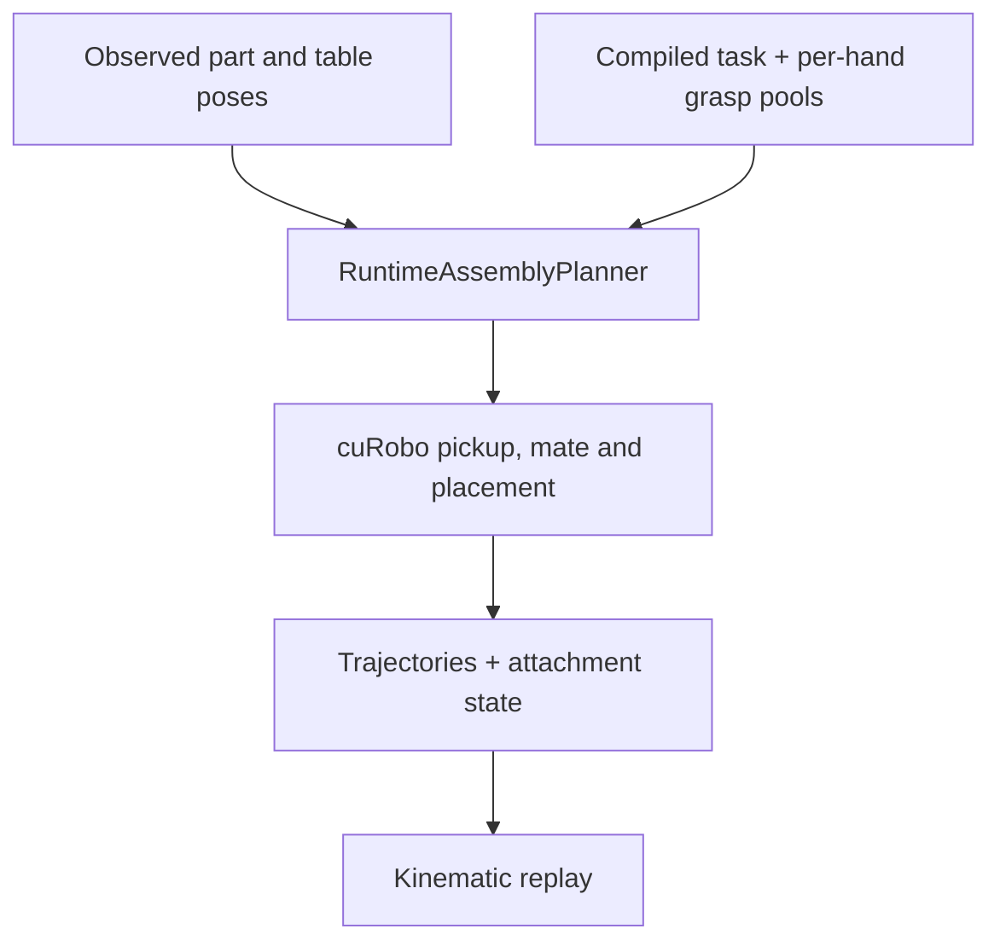

# Runtime assembly planning

The runtime combines observed part poses, a compiled assembly task and qualified
grasp pools. It saves cuRobo trajectories and symbolic attachment events for
kinematic replay. The two recorded scenes are a planning checkpoint; magnetic
forces, real retention and robot execution are outside that result.

| Responsibility | Entry point |
| --- | --- |
| Task state transitions | [`task.py`](../g1_aprilcube_demo/assembly/task.py), [`task YAML`](../config/tasks/t_u_cube_humanoid_v1.yaml) |
| Observation validation | [`observation.py`](../g1_aprilcube_demo/runtime/observation.py), [`nominal observation`](../config/observations/t_u_cube_nominal_v1.yaml), [`shuffled observation`](../config/observations/t_u_cube_shuffled_v1.yaml) |
| Role assignment and complete-plan search | `RuntimeAssemblyPlanner` in [`runtime_assembly.py`](../g1_aprilcube_demo/planning/runtime_assembly.py) |
| Native planner interface and attachments | `CuroboBackend` in [`curobo_backend.py`](../g1_aprilcube_demo/planning/curobo_backend.py) |
| Candidate alternatives and transforms | [`grasp_goalset.py`](../g1_aprilcube_demo/planning/grasp_goalset.py) |
| CLI and trajectory renderer | [`run_runtime_assembly.py`](../tools/run_runtime_assembly.py), [`render_full_assembly.py`](../tools/render_full_assembly.py) |

The compiled sequence picks T, picks U, mates U to T, picks the head, mates the
head to T, and places the completed assembly. A holder/worker role maps to an
actual left or right arm only when the necessary per-hand pools are available.
Names govern the mapping; slicing unnamed joint arrays is not equivalent.

A goal set represents alternative endpoints within one planning problem.
Paired two-tool mating poses must remain paired; independently chosen tool
indices can produce a combination that was never an intended hypothesis.
Attachment updates must reach both IK and trajectory-optimization collision
models. The adapter does not implement a separate IK solver or Cartesian
interpolator.

## Input availability

The current planner config is
[`t_u_cube_runtime_v2.yaml`](../config/planning/t_u_cube_runtime_v2.yaml).
It refers to generated robot and part models, hand descriptors and grasp pools.
Those files are not all bundled with a source clone:

| Input | Generation / location |
| --- | --- |
| Current Dex3 descriptors | `tools/build_dex3_rev1_descriptors.py`; outputs under the pinned GraspGenX checkout |
| Printable parts and watertight grasp meshes | `tools/build_aprilcube_parts.py` and `tools/build_aprilcube_grasp_meshes.py`; outputs under `generated/aprilcube_parts/` |
| Fixed-torso G1 model with both hands | `tools/build_g1_dual_arm_model.py`; outputs under `generated/robot/` |
| Per-hand task pools | Paths in the task YAML; produced from the matching qualification records |

The source tree preserves all original configs and generation tools. Reusing a
generated pool requires its matching geometry and provenance. The selected
40 mm pool is not a replacement for the 45 mm assembly inputs. The complete
historical GPU environment and generated-input reproduction have not been
rerun as part of branch consolidation.

## Reading the saved result

The runtime writes its report, trajectories and replay state under the selected
output directory. The renderer reconstructs the saved motion and attachment
state. A symbolic mate or release changes that state; it does not simulate the
magnet or verify that a physical object remains attached.

The [recorded assembly clip](assets/t_u_cube_runtime_curobo_v2.mp4) and
[research guide](https://sri299792458.github.io/g1-research-docs/manipulation/assembly.html)
show the demonstrated scope and explain the support-selection failures. The
later physical project narrowed the task to cube pickup and stacking.
