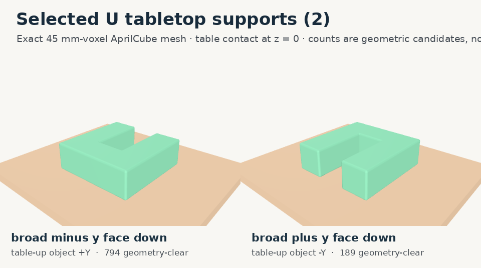

# U support-conditioned right-Dex3 proposal audit

This is a pre-physics geometric audit. It does **not** claim that any
candidate closes on, lifts, or retains the U.

## Scope

- Raw immutable GraspGenX candidates: **100,000**
- Stable tabletop orientations: **2**
- Candidate/support pairs checked: **200,000**
- Geometric survivors: **983**
- Pre-physics proposal buckets: **85**

Absolute tabletop height, XY translation, and in-plane yaw are absent
because they do not change object–support clearance. They belong to arm
reachability, not this object-relative support audit.

## Stable supports and gates

| Table-up object axis | Label | Equivalence class | Final table-clear | Pregrasp table-clear | Final object-clear | Full corridor-clear |
|---|---|---|---:|---:|---:|---:|
| +Y | broad_minus_y_face_down | broad_face | 1,619 | 1,593 | 796 | 794 |
| -Y | broad_plus_y_face_down | broad_face | 722 | 719 | 190 | 189 |

Only the support conditions selected by this experiment are evaluated.
Geometric symmetries remain recorded as equivalence classes rather
than silently deleting tag-distinguishable poses.

## Survivor distribution by semantic U component

| Support | Hip bridge | Left leg | Right leg | Unresolved | Total |
|---|---:|---:|---:|---:|---:|
| broad_minus_y_face_down | 285 | 188 | 186 | 135 | 794 |
| broad_plus_y_face_down | 61 | 27 | 26 | 75 | 189 |

The JSON artifact retains all 85 exact buckets, including surface,
cavity/exterior relation, support relation, approach direction, and
every concrete member ID. Nothing is selected or discarded by the
bucketing stage.

These are proposal buckets, not final grasp families. Final families
must be constructed only after physical closure and retention succeed.

## Required next gate

Run every geometric survivor in the corrected table-supported Isaac
test: collision-free pregrasp, complete approach, finger closure,
vertical lift, and hold under gravity. Only those successes may enter
the final object-centric family library.
